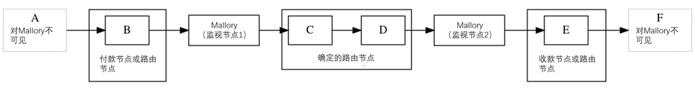

```
title: 'Bitcoin Optech Newsletter #163'
permalink: /zh/newsletters/2021/08/25/
name: 2021-08-25-newsletter-zh 
slug: 2021-08-25-newsletter-zh 
type: newsletterk
layout: newsletter
lang: zh
```

本周的 Newsletter 总结了关于将 LN 通固定费用设置为零的讨论，还包括我们的常规部分，介绍了 Bitcoin Stack Exchange 中的热门问题和答案，如何为 taproot 做准备，新版本和候选版本，以及主流的比特币基础设施软件中值得注意的变更。

## 新闻
- **零固定费用 LN 讨论**：在 LN 协议中，花费者可以选择向每个帮助成功将付款路由到最终目的地的节点支付多少钱。反过来，路由节点可以选择拒绝任何没有为他们提供足够费用的付款尝试。为了使这种机制发挥作用，路由节点需要告知花费者他们期望的费用。[BOLT7] (https://github.com/lightningnetwork/lightning-rfc/blob/master/07-routing-gossip.md)使路由节点可以公布两个与费用有关的参数，即 `fee_base_msat` （固定费用）和 `fee_proportional_millionths` （比例费用）。

  René Pickhardt 和 Stefan Richter 最近发表的一篇[论文](https://arxiv.org/abs/2107.05322)提出了一种新的寻路技术，付款人将能够使用这种技术来尽量减少他们的费用和他们成功发送付款所需的付款尝试次数（以及一些其他好处）。但当前在网络上部署该技术会遇到两个与 LN 固定费用和[多路径支付](https://bitcoinops.org/en/topics/multipath-payments/)有关的问题。

  - **更多的分路，更多的费用**：比较用单路径支付和分成两条路径支付相同金额的方式：它们都将支付相同金额的总比例费用（因为总支付金额相同），但双路径支付将支付两倍的总固定费用（因为它使用两倍的跳数）。如果使用 `x` 个支付金额相同的路径进行支付，固定费用会高达 `x` 倍。这使得使用多路径支付更加昂贵，因此也不利于使用多路径支付的技术的发展。

  - **计算上的困难**：正如论文第2.3节所述，在有固定费用的情况下，寻路算法不容易计算出路径，同时支付也会被分成多份。从长远来看，也许可以通过算法解决这个问题，但对于算法的实现者来说，最简单的解决方案是取消固定费用。

  在[播客](https://coinspondent.de/2021/07/11/honigdachs-62-pickhardt-payments/)和 [Twitter](https://twitter.com/renepickhardt/status/1414895869078523910) 上，作者建议，如果节点运营商将他们的固定费用设置为零，就可以在不改变LN协议的情况下立即解决这个问题。他们进一步建议运营商可以立即开始这样做，即使他们的工作还不能在生产环境中部署。这引发了 LN 开发者在 Twitter 上的几次讨论，Anthony Towns 帮助将这些讨论转移到 Lightning-Dev [邮件列表](https://lists.linuxfoundation.org/pipermail/lightning-dev/2021-August/003174.html)中。

  Towns 赞成用户将固定费用设置为零，因为这不仅对多路径拆分有好处，而且对节点运营商来说只剩下一个费用参数，即比例费用，也更容易优化。

  Matt Corallo [回答](https://lists.linuxfoundation.org/pipermail/lightning-dev/2021-August/003179.html)说，创建用于路由支付的 [HTLC](https://bitcoinops.org/en/topics/htlc/) 会给节点带来一些负担，而这些负担无论支付的金额是多少都是不变的。固定费用使得节点可以获得这些成本的补偿。Towns 的反驳观点认为，这些成本对于成功的路由支付和不成功的路由支付本质上是一样的，但 LN 节点只在成功的情况下被支付。如果节点愿意在某些情况下接受这些成本并且不要求补偿，为什么不在所有情况下无偿接受这些成本呢？对于比例费用也是同样的情况。因此又进一步引发一些关于[预付费用](https://bitcoinops.org/en/topics/channel-jamming-attacks/)的简短讨论，这些费用可以让节点在即使是不成功的支付中也能得到补偿。

  Towns 还建议，即使没有固定费用，节点也有可能通过简单地拒绝发送低于一定规模的付款来确保其收到最低费用。例如，一个目前固定费用为1聪的节点，可以通过设置0.1%的比例费用和1,000聪的最低金额确保它至少可以收到1聪的费用。但这种情形会扼杀小额支付。不过，虽然仍然存在争议，LN 节点已经可以在不使用 HTLC 的情况下处理小额支付，从而消除了一些固定成本，并使仅收取比例费用的收费模式更合适。

  在后来的讨论中，Olaoluwa Osuntokun [强调](https://lists.linuxfoundation.org/pipermail/lightning-dev/2021-August/003187.html)了之前提出的一个观点，即节点运营商没有必要现在就为了一个还没有人准备在生产环境中使用的算法去修改一个参数。他和 Corallo 想看看是否会有进一步的研究和开发工作能让该算法（或基于不同原理的类似算法）即使在固定费用不为零的情况下也能良好运转。

  截至本文写作时，讨论没有达成明确的结论。

## Bitcoin Stack Exchange 问答选摘
*[Bitcoin Stack Exchange](https://bitcoin.stackexchange.com/) 是 Optech 贡献者寻找问题答案，或者当我们有一些空闲时间时帮助好奇或困惑的用户的首选地方之一。在这个月度专题中，我们将重点介绍一些自上次更新以来被投票最多的问题和答案。*

- [为什么 Bitcoin Core 支持交易索引而不是地址索引？](https://bitcoin.stackexchange.com/a/107619)Andrew Chow 解释了 Bitcoin Core 的交易索引在验证交易方面的历史意义（后来[被 UTXO 数据库取代](https://github.com/bitcoin/bitcoin/issues/1677)），并概述了反对在 Bitcoin Core 中添加地址索引功能的理由，包括维护费用、缺乏令人信服的使用案例，以及担心这种索引超出了Bitcoin Core的项目范围。

- [`mempool` 的 P2P 信息可靠吗？](https://bitcoin.stackexchange.com/a/108229) Claris 和 Pieter Wuille 解释了 `mempool` P2P 消息的历史。自从在 [BIP35](https://github.com/bitcoin/bips/blob/master/bip-0035.mediawiki) 中被引入以向 SPV 节点展现一个全节点的 mempool 内容后，该消息随后也被 [BIP37
](https://github.com/bitcoin/bips/blob/master/bip-0037.mediawiki) 的[布隆过滤器](https://bitcoinops.org/en/topics/transaction-bloom-filtering/)支持，现在默认是禁用的。如果想要支持 `mempool` 请求，可以使用 `-whitelist=mempool` 和 `-whitebind=mempool` 配置选项进行配置。

- [什么是 SIGHASH_ANYPREVOUTANYSCRIPT？](https://bitcoin.stackexchange.com/a/107797) Michael Folkson 总结了 Christian Decker 对 [BIP118](https://github.com/bitcoin/bips/blob/master/bip-0118.mediawiki) 提出的[签名哈希（sighashes）](https://en.bitcoin.it/wiki/Contract#SIGHASH_flags)的比较。`SIGHASH_ANYPREVOUT` sighash 对 `scriptPubKey` 承诺，但放弃了对一个特定 UTXO 的承诺。`SIGHASH_ANYPREVOUTANYSCRIPT` sighash 放弃了对输入的金额以及特定的 `scriptPubKey` 的承诺，后者是支持 [eltoo](https://bitcoinops.org/en/topics/eltoo/) 的基础。

- [LN 流动性广告和双边供资通道是否允许第三方购买的流动性（"边车通道"）？](https://bitcoin.stackexchange.com/a/107786) David A. Harding 指出，虽然目前不支持，但使用[流动性广告](https://bitcoinops.org/en/topics/liquidity-advertisements/)和[双边供资](https://bitcoinops.org/en/topics/dual-funding/)通道的第三方购买流动性是可能的。他总结了 Lisa Neigut 关于链上 PSBT 工作流程和链下工作流程的想法。

- [在 ECDSA 和 Schnorr 签名中使用相同的私钥是否存在风险？](https://bitcoin.stackexchange.com/questions/107924/are-there-risks-to-using-the-same-private-key-for-both-ecdsa-and-schnorr-signatu) Pieter Wuille 指出，虽然没有已知的跨 [schnorr](https://bitcoinops.org/en/topics/schnorr-signatures/) 和 ECDSA 的密钥重用攻击，但 "为了保持在可证明的安全范围内，最好确保 ECDSA 密钥和 schnorr 密钥使用不同的硬化衍生步骤。"

## 为 taproot 做准备#10: PTLCs
*关于开发者和服务提供者如何为即将在区块高度709,632处激活的 taproot 做准备的每周[系列](https://bitcoinops.org/en/preparing-for-taproot/)文章。*

在[上周的专栏](https://bitcoinops.org/en/preparing-for-taproot/#signature-adaptors)中，我们探讨了[签名适配器](https://bitcoinops.org/en/topics/adaptor-signatures/)，以及带有 [schnorr](https://bitcoinops.org/en/topics/schnorr-signatures/) 签名的 [taproot](https://bitcoinops.org/en/topics/taproot/) 的使用将如何使适配器的使用变得更加隐私、容易和高效。有几种方法可以在比特币上使用签名适配器，但最直接有益的是使用在时间点锁定合约（[PTLCs](https://bitcoinops.org/en/topics/ptlc/)）中，它可以取代多年来一直被使用的[古老的](https://bitcoinops.org/en/topics/htlc/#history)哈希时间锁定合约（[HTLCs](https://bitcoinops.org/en/topics/htlc/)）。他会带来一些优势，但也带来了一些挑战。为了理解这些优势和挑战，我们首先从一个简化的 HTLCs 使用的例子开始；下面的例子可以是链下 LN 支付，链上代币交换，或者是像闪电环一样的链上/链下混合系统——正是这种灵活性使得 HTLCs 得到了广泛的使用。

Alice 想通过 Bob 来支付给 Carol，但 Alice 和 Carol 都不想信任鲍勃。Carol 创建了一个随机的原像，并用 SHA256 算法对其进行哈希。Carol 把哈希值给了 Alice，并对原像保密。Alice 开始向 Bob 付款，他可以用他公钥对应的签名和原像来获得付款；或者，Alice 可以在10个区块后通过用她的公钥签名将交易退回给她自己来获得退款。下面是用 Minsc 语言描述的这个[过程](https://min.sc/#c=%2F%2F%20Traditional%20preimage-based%20HTLC%0A%24alice%20%3D%20A%3B%0A%24bob%20%3D%20B%3B%0A%24carol%20%3D%20C%3B%0A%24preimage%20%3D%20H%3B%0A%0A%28pk%28%24bob%29%20%26%26%20sha256%28%24preimage%29%29%20%7C%7C%20%28pk%28%24alice%29%20%26%26%20older%2810%29%29)。

```bash
(pk($bob) && sha256($preimage)) || (pk($alice) && older(10))
```
Bob 现在可以用基本相同的脚本向 Carol 发起相同金额的付款（也许要减去费用），只是[更新](https://min.sc/#c=%2F%2F%20Traditional%20preimage-based%20HTLC%0A%24alice%20%3D%20A%3B%0A%24bob%20%3D%20B%3B%0A%24carol%20%3D%20C%3B%0A%24preimage%20%3D%20H%3B%0A%0A%28pk%28%24carol%29%20%26%26%20sha256%28%24preimage%29%29%20%7C%7C%20%28pk%28%24bob%29%20%26%26%20older%285%29%29)了参与人，并减少了退款时间。

```bash
(pk($carol) && sha256($preimage)) || (pk($bob) && older(5))
```
现在，Carol 可以通过使用原像在五个区块内向 Bob 获取付款，同时也向 Bob 透露了原像。这使得 Bob 可以在五个区块内向 Alice 索取付款。

### HTLCs 的隐私问题
如果上面的脚本是在链上发布的，重复使用相同的哈希值和原像会让人立即明白 A 通过 B 支付 C，这对于同一条链以及跨链的代币互换操作来说可能会成为一个重大的问题。不太明显的是，这也是 LN 等链下路由协议的一个问题。如果我们想象一个较长的路由路径，一个人控制了路径上的多个节点，他们可以看到重复使用相同的哈希和原像，从而可以确定一些节点是路由节点，增加推测出其余节点是花费者或接收者的概率。这是*可链接*问题的一个部分，并且可能是 LN 目前最大的隐私弱点。



虽然[多路径支付](https://bitcoinops.org/en/topics/multipath-payments/)部分缓解了 LN 的可链接问题的其他方面，例如支付金额的可链接性，但它可能会使哈希的可链接性问题变得更糟，因为它给监视路由节点更多的机会来关联哈希。

当前 HTLC 的另一个问题是，任何需要上链的脚本都明显与正常的花费者脚本不同。这使得监视者更容易识别使用模式，也许还能有效地猜测个别用户的具体信息。

### PTLC的解决方案
在之前的 Minsc 风格的脚本中，我们有一个函数，只有当它被传递给一个事先选定的特定值（预像）时才会返回真。[签名适配器](https://bitcoinops.org/en/topics/adaptor-signatures/)也是类似的，只有当一个函数被传入一个被揭示的值（在签名适配器中是一个标量）时，它才能被转化为一个有效的签名。如果我们暂时忽略[多重签名](https://bitcoinops.org/en/topics/multisignature/)，我们可以将前面的 HTLC 脚本转化为以下 PTLC ：

```bash
(pk($bob) && pk($alice_adaptor)) || (pk($alice) && older(10))
```

```bash
(pk($carol) &&pk($bob_adaptor)) || (pk($bob) && older(5))
```

简而言之，Carol 给 Alice 提供了她的隐藏标量的 EC 点，Alice 讲其与她选择的公钥一起创建一个签名适配器，并交给 Bob；Bob 可以使用同一个点以及他选择的公钥创建一个适配器，交给 Carol。Carol 通过将 Bob 的适配器转换为有效的签名来揭示标量，并拿到 Bob 的转账。Bob 从有效的签名中恢复了标量，使他能够将 Alice 的适配器转化为自己的有效签名，并拿到 Alice 的转账。

这就解决了针对链上监控的可链接性问题，因为任何人在看区块链时看到的都是一堆不同公钥的有效签名。第三方不可能知道使用了适配器，更不可能知道这些适配器是基于什么标量的。

然而，上述程序并不能阻止参与路由的监视节点将付款联系起来。如果所有的支付都是基于同一个标量，那么所有的支付就像使用了哈希锁和原像时一样被联系在一起。这这问题可以通过每个路由节点选择自己的标量，然后在付款通过其节点时删除其对应的点来解决。让我们修改一下我们的例子。

像以前一样，Carol 给了 Alice 标量的点，但不同的是 Alice 也向 Bob 请求一个点。Alice 使用 Carol 的点和 Bob 的点的集合来构建她给 Bob 的适配器。Bob 知道他的点，所以他能够从 Alice 那里收到的适配器中减去这个点。使用结果点（Bob 不知道现在的结果是 Alice 最初从 Carol 那里得到的点），Bob 构建了他给 Carol 的适配器。Carol 知道最终点的标量，因此将 Bob 的适配器转换为一个有效的签名。像以前一样，Bob 从 Carol 的签名中恢复了她的标量，并使用它和他自己的标量将 Alice 的适配器转换成有效的签名。

在这条路径的两个跳中，Alice→Bob 和 Bob→Carol，使用了两个不同的 EC 点和标量，消除了可链接性。我们可以将此扩展到我们在使用 HTLCs 时会遇到的较长的路径，看看在这种场景下如何改善隐私。


正如上周所提到的，schnorr 签名使我们可以很容易地将适配器签名与多重签名组合。对于通用 PTLC 的情况，我们可以将我们的链上脚本减少至如下：

```bash
pk($bob_with_alice_adaptor) || (pk($alice) && older(10))
```

```bash
pk($carol_with_bob_adaptor) || (pk($bob) && older(5) )
```

通过 taproot，左边的分支可以成为 keypath，右边的分支可以成为 tapleaf。如果该路径支付成功，Bob 和 Carol 可以直接在链上结算，而不需要他们的对手方参与，这使得这种路由支付与单签名支付、正常的多重签名支付以及需要合作完成的合约没有区别。它还最大限度地减少了对区块空间的使用。如果其中一个退款情况需要被执行，也仍然会是非常高效和私密的—— `pk(x) && older(n)` 与[降级多签](https://github.com/bitcoinops/taproot-workshop/blob/master/3.1-degrading-multisig-case-study.ipynb)、[强制持仓](https://bitcoin.stackexchange.com/questions/69809/op-checklocktimeverify-op-hodl-script)和其他各种可能的脚本没有区别。

在下周的专栏中，我们最喜欢的 LN 开发者之一的客座文章将讨论 LN 采用 keypath spends、multisignatures、PTLCs 和其他基于 taproot 实现的功能所需的一些变更。

## 发布和候选发布
*主流的比特币基础设施项目的新版本和候选版本。请考虑升级到新版本或帮助测试候选版本。*

- [Rust-Lightning 0.0.100](https://github.com/rust-bitcoin/rust-lightning/releases/tag/v0.0.100) 是一个新的发布版本，支持发送和接收 [keysend](https://bitcoinops.org/en/topics/spontaneous-payments/) 付款，提供了更便捷的路由支付追踪功能，并能够记录节点在相关支付流程中获得的手续费。

- [Bitcoin Core 22.0rc2](https://bitcoincore.org/bin/bitcoin-core-22.0/)是下一个主要版本的全节点实现及其相关钱包和其他软件的候选发布版本。这个新版本的主要变化包括支持[I2P](https://bitcoinops.org/en/topics/anonymity-networks/)连接，取消了对[第二版Tor](https://bitcoinops.org/en/topics/anonymity-networks/)连接的支持，并加强了对硬件钱包的支持。

- [Bitcoin Core 0.21.2rc1](https://bitcoincore.org/bin/bitcoin-core-0.21.2/) 是 Bitcoin Core的维护版本的一个候选发布版本，包含了若干代码中的缺陷修复以及小规模的实现优化。

## 重大代码和文档更新
*本周[Bitcoin Core](https://github.com/bitcoin/bitcoin)、[C-Lightning](https://github.com/ElementsProject/lightning)、[Eclair](https://github.com/ACINQ/eclair)、[LND](https://github.com/lightningnetwork/lnd/)、[Rust-Lightning](https://github.com/rust-bitcoin/rust-lightning)、[libsecp256k1](https://github.com/bitcoin-core/secp256k1)、[Hardware Wallet Interface(HWI)](https://github.com/bitcoin-core/HWI)、[Rust Bitcoin](https://github.com/rust-bitcoin/rust-bitcoin)、[BTCPay Server](https://bitcoinops.org/en/newsletters/2021/08/11/)、[Bitcoin Improvement Proposals(BIPs)](https://github.com/bitcoin/bips/)和[Lightning BOLTs](https://github.com/lightningnetwork/lightning-rfc/)中值得注意的变更。*

- [Bitcoin Core #22541](https://github.com/bitcoin/bitcoin/issues/22541) 添加了一个新的 `restorewallet` RPC 命令，可用于加载一个钱包备份。 `restorewallet` 补充了现有的 `backupwallet` 命令，而后者用于导出当前加载的钱包的副本。需要注意的是，`backupwallet` 和 `restorewallet` 是旧的 `dumpwallet` 和 `importwallet` RPC 的替代品，而这两个旧命令会使用单​​独的文件。[Bitcoin Core #22523](https://github.com/bitcoin/bitcoin/issues/22523) 中备份和恢复钱包文档的更新中有对这项工作的详尽说明。

- [LND #5442](https://github.com/lightningnetwork/lnd/issues/5442) 允许在不添加任何新输出的情况下向 [PSBT](https://bitcoinops.org/en/topics/psbt/) 添加输入，这在创建 [CPFP fee bump](https://bitcoinops.org/en/topics/cpfp/) 时非常有用。

- [Rust-Lightning #1011](https://github.com/rust-bitcoin/rust-lightning/issues/1011) 添加了对尚未合并的 [BOLT #847](https://github.com/lightningnetwork/lightning-rfc/issues/847) 的支持，它允许两个对等通道方对共同关闭的交易中应支付的费用进行协商。在当前协议中，只有一方发送费用，另一方只能接受或拒绝该费用的数额。

- [BOLTs #887](https://github.com/lightningnetwork/lightning-rfc/issues/887) 更新了 [BOLT11](https://github.com/lightningnetwork/lightning-rfc/blob/master/11-payment-encoding.md)，来要求消费者在支付时不管接收者的 `payment_secret` 特征位如何，都要指定 [payment secret](https://bitcoinops.org/en/topics/payment-secrets/)。接收方应验证 payment secret，以防止在简化的多路径支付中被探测攻击。这个验证功能已在我们覆盖的所有四个 LN 实现中实施。