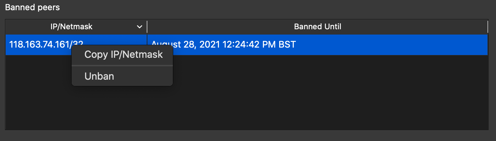

本周的 Newsletter 介绍了一个新的基于 web 的解码和修改 PSBT 的工具，并链接到一篇博文和一个基于 eltoo 的 LN 支付通道的概念验证实现。另外还包括我们的常规部分，包括为 taproot 做准备的内容，新版本和候选版本的通告，以及主流的比特币基础设施软件中值得注意的变更。

## 新闻
 - **BIP174.org：** Alekos Filini 在 Bitcoin-Dev 邮件列表中[发布](https://lists.linuxfoundation.org/pipermail/bitcoin-dev/2021-August/019355.html)了他和 Daniela Brozzoni 创建的一个[网站](https://bip174.org/)，该网站将 [PSBT](https://bitcoinops.org/en/topics/psbt/) 解码为人可读的字段列表。这些字段的内容可以被编辑并重新编码为一个序列化的 PSBT，帮助开发者快速为他们的 BIP174 实现创建测试。Christopher Allen [回复](https://lists.linuxfoundation.org/pipermail/bitcoin-dev/2021-August/019356.html)说，建议该工具也支持创建二维码（标准二维码或可以处理其他大于 3KB 的 PSBT 的方案；见 [Newsletter #96](https://bitcoinops.org/en/newsletters/2020/05/06/#qr-codes-for-large-transactions)）。

- **Eltoo 示例通道：** Richard Myers 之前在 AJ Towns 实现的 [SIGHASH_ANYPREVOUT](https://bitcoinops.org/en/topics/sighash_anyprevout/) 的基础上，使用 Bitcoin Core 集成测试实现了一个 [eltoo](https://bitcoinops.org/en/topics/eltoo/) 通道的例子（见 [Newsletter #63](https://bitcoinops.org/en/newsletters/2019/09/11/#eltoo-sample-implementation-and-discussion)）。正如在 Bitcoin-Dev 邮件列表中[提到](https://lists.linuxfoundation.org/pipermail/bitcoin-dev/2021-August/019342.html)的，他现在也写了[一篇详细的博文](https://yakshaver.org/2021/07/26/first.html)，描述了 eltoo 通道支持的交易。同时，结合他的集成测试，可以允许任何对 eltoo 感兴趣的人尝试使用。此外，对 eltoo 的几个可能的改进也在文章中有所介绍，供感兴趣的人进一步研究。

## 为 taproot 做准备 #11: 带 taproot 的 LN
*关于开发者和服务提供者如何为即将在区块高度 709,632 处激活的 taproot 做准备的每周[系列](https://bitcoinops.org/en/preparing-for-taproot/)文章。*

*作者：[ZmnSCPxj](https://zmnscpxj.github.io/about.html)，LN 协议开发者*

在这篇文章中，我们将介绍 [taproot](https://bitcoinops.org/en/topics/taproot/) 支持 LN[[1]](#myfootnote1) 实现的两个隐私功能。
- LN 上的 [PTLC](https://bitcoinops.org/en/topics/ptlc/)[[2]](#myfootnote2)。
- P2TR 通道。

### LN 上的 PTLC
PTLC 实现了[许多功能](https://suredbits.com/payment-points-monotone-access-structures/)，其中一个主要的功能就是支持 LN 在不需要随机路线[1](#footnote1)的情况下实现[支付无关性](https://bitcoinops.org/en/newsletters/2021/08/25/#preparing-for-taproot-10-ptlcs)。沿着单路径或[多路径](https://bitcoinops.org/en/topics/multipath-payments/)路线的每个节点都可以得到一个标量用来调整每个转发的 PTLC，实现*支付无关性*，在这个过程中，单个路由节点不会再[泄露](https://bitcoinops.org/en/newsletters/2021/08/25/#privacy-problems-with-htlcs) LN 支付的唯一标识。

PTLC **不是隐私的万能药**。如果一个监视者节点看到一个具有特定时间锁和金额的转发，而第二个监视者节点在不久之后看到一个具有更低的时间锁和金额的转发，那么即使监视者节点不能再通过唯一标识识别哈希值来关联它们，也能推测这些转发很可能属于同一支付路径。但是，PTLC *确实*能够实现下面这几点：

- 增加分析中的不确定性。监视者推测正确的概率现在更低了，因此他们的信息的价值就降低了。
- 在多路径支付中，*有更多*的不相关因素。不同的路径的时间锁及支付金额相关性不强，且若 LN 成功，其中会有足够多的时间相关性不强的付款。
- 与[HTLC](https://bitcoinops.org/en/topics/htlc/)相比，成本没有增加（甚至可能因为[多重签名](https://bitcoinops.org/en/newsletters/2021/08/04/#preparing-for-taproot-7-multisignatures)的效率而略微降低成本）。

原则上，一个 pre-taproot 通道可以在不需要关闭和重新打开通道的情况下升级到支持 PTLC。现有通道支持 PTLC 的方法是创建一个链外交易，将现有的非 taproot 资金输出转为包含 PTLC 的 taproot 输出。也就是说，要在 LN 上增加对 PTLC 的支持，除了要求每个节点和它的通道的对等节点升级他们的软件外，不需要用户付出任何成本。

然而，要实际使用 PTLC，从支出方到接收方的每个转发节点都必须支持 PTLC。这意味着在有足够数量的节点升级之前，对 PTLC 的支持可能大部分都没有被使用。节点不一定都需要使用相同的协议（可能会有多个 PTLC 协议），但它们都必须支持某一些 PTLC 协议。支持多个 PTLC 协议会有额外的维护成本，我*希望*我们不要有太多这样的协议（最好只有一个）。

### P2TR 通道
提升基础层和 LN 层之间的不相关性的一个方案是[非公开通道](https://bitcoinops.org/en/topics/unannounced-channels/)—— LN 上不会广播这些通道的存在。

不幸的是，每一个 LN 通道都需要两个签名者之间的合作，而在目前的 pre-taproot 的比特币中，每一个 2-of-2 脚本都是*公开*编码的。LN 是 2-of-2 多签名最主要的使用场景，所以从任何查看区块链的人都可以看到一个 LN 通道被关闭。然后可以基于此追踪资金，如果它们进入另一个 P2WSH 输出，就可以推测出这很可能是*另一个*非公开通道。因此，即使是非公开通道，一旦被关闭，也是可以在链上识别的，虽然可能在一定程度上会误判。

Taproot 通过使用 [schnorr 签名](https://bitcoinops.org/en/topics/schnorr-signatures/)，可以让 [n-of-n](https://bitcoinops.org/en/topics/schnorr-signatures/) 看起来和 1-of-1 完全一样。通过一些处理，甚至可以让 [k-of-n](https://bitcoinops.org/en/topics/threshold-signature/) 和 1-of-1（以及 n-of-n）看起来一样。由此我们可以提出一个功能，即一个由 P2TR UTXO 支持的 LN 通道，也就是一个增加了非公开通道的*链上*隐私的 P2TR 通道。[2](#footnote2)

这种（相当小的）隐私提升也有助于公开的通道。已公开的通道只有在打开的时候才会被广播，所以当有人试图寻找已公开的通道时，不能找到*历史*通道。如果监视者想看到每一个已公开的通道，它必须自己存储所有这些数据，无法依赖任何一种存档节点。

此外，taproot keypath 的花费比 LN 现有的 P2WSH 花费小 38.5 vbytes（40%）。不幸的是，你**不能把现有的 pre-taproot 通道升级为 P2TR 通道**。现有的通道使用现有的 P2WSH 2-of-2 方案，必须要关闭才能切换到 P2TR 通道。

从理论上讲，实际的存款交易的输出点只有使用该通道的两个节点关注，网络上的其他节点不会关心任何两个节点之间的通道的安全问题。然而，公开的通道是通过 LN gossip 网络共享的。当一个节点收到一个传输过来的公开通道时，它会咨询自己信任的比特币全节点，检查存款输出点处是否存在，以及更重要的是检查**地址是否正确**。检查地址有助于确保无法滥用通道传播机制，因为你需要区块链上存有资金，才能发送通道信息。因此，在实践中，即使是 P2TR 通道也需要一定程度的远程节点的兼容；否则，发送者在选择路由时会忽略这些通道，因为他们无法验证这些通道是否存在。

### 时间范围
我认为在一个 FOSS 项目中给功能确定实现需要的时间范围的最好方法是查看*以前*的功能和它们所花的时间，并将这些作为功能实际部署所需时间的参考。[3](#footnote2)

我认为最近的新的主要功能在范围上与 LN 的 PTLC 相似的就是[双边供资](https://bitcoinops.org/en/topics/dual-funding/)。Lisa Neigut 在 [BOLTs #524](https://github.com/lightningnetwork/lightning-rfc/issues/524) 中提出了一个关于双边供资协议的初步提案，而[主网上的第一个双边供资通道](https://medium.com/blockstream/c-lightning-opens-first-dual-funded-mainnet-lightning-channel-ada6b32a527c)几乎在两年零六个月后才被[打开](https://blockstream.info/tx/91538cbc4aca767cb77aa0690c2a6e710e095c8eb6d8f73d53a3a29682cb7581)。双边供资只需要与你的直接连接的节点兼容，而LN 上的 PTLC 需要与你所选择的路径上的所有路由节点兼容，包括接收方。所以我觉得因为它增加了复杂性，有理由给这个功能一个 +50% 的时间调整。预计从一个具体的 PTLC 协议被提出开始，需要 3 年零 9 个月才能被应用。

对于 P2TR 通道，我们应该注意到，虽然这“只涉及到”两个直接连接的节点，但它带来的好处也较少。因此，我预计它的优先级会比较低。假设大多数开发者优先考虑 PTLC 而不是 LN，那么我预计 P2TR 通道将在底层的 [SIGHASH_ANYPREVOUT](https://bitcoinops.org/en/topics/sighash_anyprevout/) 或其他实现 Decker-Russell-Osuntokun（"[Eltoo](https://bitcoinops.org/en/topics/eltoo/)"）的方式出现时开始工作。

## 发布和候选发布
*主流的比特币基础设施项目的新版本和候选版本。请考虑升级到新版本或帮助测试候选版本。*

- [Bitcoin Core 22.0rc3](https://bitcoincore.org/bin/bitcoin-core-22.0/) 是下一个主要版本的全节点实现及其相关钱包和其他软件的候选发布版本。这个新版本的主要变化包括支持 [I2P](https://bitcoinops.org/en/topics/anonymity-networks/) 连接，取消了对[第二版 Tor](https://bitcoinops.org/en/topics/anonymity-networks/) 连接的支持，并加强了对硬件钱包的支持。

- [Bitcoin Core 0.21.2rc2](https://bitcoincore.org/bin/bitcoin-core-0.21.2/) 是 Bitcoin Core的维护版本的一个候选发布版本，包含了若干代码中的缺陷修复以及小规模的实现优化。

## 重大代码和文档更新
*本周 [Bitcoin Core](https://github.com/bitcoin/bitcoin)、[C-Lightning](https://github.com/ElementsProject/lightning)、[Eclair](https://github.com/ACINQ/eclair)、[LND](https://github.com/lightningnetwork/lnd/)、[Rust-Lightning](https://github.com/rust-bitcoin/rust-lightning)、[libsecp256k1](https://github.com/bitcoin-core/secp256k1)、[Hardware Wallet Interface(HWI)](https://github.com/bitcoin-core/HWI)、[Rust Bitcoin](https://github.com/rust-bitcoin/rust-bitcoin)、[BTCPay Server](https://bitcoinops.org/en/newsletters/2021/08/11/)、[Bitcoin Improvement Proposals(BIPs)](https://github.com/bitcoin/bips/) 和 [Lightning BOLTs](https://github.com/lightningnetwork/lightning-rfc/) 中值得注意的变更。*

- [Bitcoin Core GUI #384](https://github.com/bitcoin-core/gui/pull/384) 增加了一个上下文菜单选项，可以复制被禁节点表中的 IP/Netmask。这有助于 GUI 用户更容易地从他们的禁止列表中分享地址。

  

- [C-Lightning #4674](https://github.com/ElementsProject/lightning/issues/4674) 增加了`datastore`、`deldatastore` 和 `listdatastore` 命令，供插件在 C-Lightning 数据库中存储和管理数据。还包括了对每个命令语义进行详细说明的手册。

- [LND #5410](https://github.com/lightningnetwork/lnd/issues/5410) 允许节点与不在 [Tor](https://bitcoinops.org/en/topics/anonymity-networks/) 基础上运行的服务建立直接连接，可以桥接仅支持 Tor 和仅支持 clearnet 的区域网络。

- [LND #5621](https://github.com/lightningnetwork/lnd/issues/5621) 将最被网络认可的区块头作为 ping 消息中 `ignored` 字段的一部分。对等节点可以使用这个信息做额外的检查，以确保他们获取了最新的区块链的信息，并且他们没有在比特币网络中被[日蚀攻击](https://bitcoinops.org/en/topics/eclipse-attacks/)。基于此，后续的工作可以使用这个数据源来提醒用户或自动采取行动来恢复。

## 脚注
<a name="footnote1">1. </a>付款人可以选择一个非常曲折的路径（即路由随机化）来使 HTLC 相关性分析出错，但这也有一些缺点：

 - 曲折的路径成本较高，*并且*可靠性更低（为了让付款成功到达目的地，需要向更多的节点支付，更多的节点需要*成功*转发）。
- 曲折的路径更长，意味着付款人要告诉*更多*的节点关于付款的信息，这使得他们*更*有可能遇到一些监视者节点。因此，曲折的路径不一定是提升隐私的完美方案。

<a name="footnote2">2. </a>在考虑非公开通道时，请记住这是一个两方参与的场景，如果一个非公开通道被关闭，然后其中一个参与者（例如，LN 服务提供商）将剩余的资金用于公开的通道，查看区块链信息的人可以推测资金的来源有一定的概率是一个被关闭的非公开通道。

<a name="footnote3">3. </a>是的，细节很重要，但它们也不重要：从全局层面来看，开发的某些方面的意外困难和开发的其他方面的未预料到的容易在时间上会互相抵消，我们可以得到的是每个主要功能大致在某个平均时间范围内。如果我们想做出**准确**的估计，而不是**感觉良好**的估计，我们应该使用避免[规划谬误](https://en.wikipedia.org/wiki/Planning_fallacy)的方法。因此，我们应该找一个类似的以前完成的功能，并*故意忽略*其细节，只看这个功能花了多长时间来实现。

<a name="myfootnote1">[1]</a>译者注：[lightning-rfc](https://github.com/lightningnetwork/lightning-rfc/blob/master/00-introduction.md)文档供开发者参考。

<a name="myfootnote1">[2]</a>译者注：PTLC 是基于 HTLC 的升级，更多信息可参考 [Optech 的介绍](https://bitcoinops.org/en/topics/ptlc/)和 [往期 Newsletter](https://bitcoinops.org/en/newsletters/2021/08/25/)。

