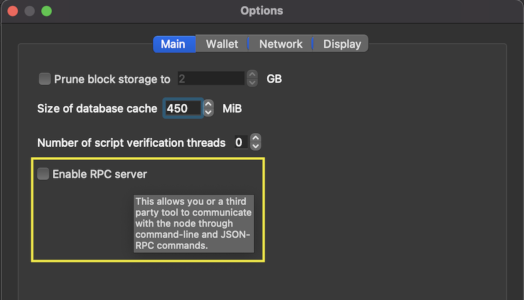

```
title: 'Bitcoin Optech Newsletter #169'
permalink: /zh/newsletters/2021/10/06/
name: 2021-10-06-newsletter-zh 
slug: 2021-10-06-newsletter-zh 
type: newsletter
layout: newsletter
lang: zh
```

本周的 Newsletter 总结了一项为比特币增加交易继承标识符的提案，还包括我们的常规部分，为 taproot 做准备，新版本和候选版本，以及主流的比特币基础设施软件中值得注意的变更。

## 新闻
 - **交易继承标识符的提案**：假名开发者 John Law 在 Bitcoin-Dev 和 Lightning-Dev 邮件列表发布了一个[帖子](https://lists.linuxfoundation.org/pipermail/bitcoin-dev/2021-September/019470.html)。Law 建议软分叉增加*继承标识符*（IID），这将使交易可以引用的祖先的 txid 和当前输入的输出的位置。例如，`0123...cdef:0:1` 表示当前的交易输入是花了 txid `0123...cdef` 的第一个输出的第二个子输出。这使得多方协议的参与者在他们事先不知道输出所在的交易的 txid 的情况下，为花费的该输出创建签名。

  这可以与由 [SIGHASH_ANYPREVOUT](https://bitcoinops.org/en/topics/sighash_anyprevout/) 软分叉所启用的，并作为 [eltoo](https://bitcoinops.org/en/topics/eltoo/) 协议的一部分被介绍的*浮动交易*相比较。*浮动交易*允许参与者在不知道 txid 的情况下为某个特定的输出创建签名，只要他们满足该输出脚本中的条件。

  Law 在一篇延伸[论文](https://github.com/JohnLaw2/btc-iids/raw/main/iids14.pdf)中描述了由 IID 促成的四种不同的协议，包括 eltoo 和[通道工厂](https://bitcoinops.org/en/topics/channel-factories/)的替代方案，以及可以简化[瞭望塔](https://bitcoinops.org/en/topics/watchtowers/)设计的想法。Anthony Towns [建议](https://lists.linuxfoundation.org/pipermail/bitcoin-dev/2021-September/019471.html)，IID 的功能可以用 anyprevout 来模拟，这是一种新的方式，尽管 Law [不认可](https://github.com/JohnLaw2/btc-iids/blob/main/response_to_towns_20210918_113740.txt)模拟的可能性。

  由于不是所有的参与者都愿意使用邮件列表，所以针对这些想法进行讨论很麻烦。如果邮件列表上的讨论恢复了，我们会在未来的 Newsletter 中总结任何值得注意的更新。

## 为 taproot 做准备 #16: 输出的可关联性
*关于开发者和服务提供者如何为即将在区块高度 709,632 处激活的 taproot 做准备的每周[系列](https://bitcoinops.org/en/preparing-for-taproot/)文章。*

在taproot激活后，用户将开始收到对 P2TR 输出的支付。之后，他们会花费这些输出。在某些情况下，他们会向非 P2TR 输出付款，但仍会使用 P2TR 的找零输出将其返还给自己。

  

观察交易的专家或算法很容易合理地推断出 P2TR 输出是用户自己的找零输出，其他输出是支付输出。这种推断并不能保证一定准确，但是是最可能的解释。

有些人认为，应该忽略 taproot 的许多[隐私优势](https://bitcoinops.org/en/preparing-for-taproot/#multisignature-overview)，因为在钱包向 P2TR 过渡期间，隐私性可能会减弱。许多专家[称](https://www.coindesk.com/tech/2020/12/01/privacy-concerns-over-bitcoin-upgrade-taproot-are-a-non-issue-experts-say/)这是毫无道理的过度反应。我们也同意，并且提供一些额外的反驳意见供参考：

- **其他元数据**：交易可能包含其他元数据会揭示哪些输出是找零，哪些是支付。其中最令人担忧的是，目前有很大比例的输出是[重复使用地址](ps.org/en/topics/output-linking/)，这大大降低了参与这些交易的花费者和接收者的隐私。只要这些问题继续存在，不为采取最佳实践的钱包和服务的用户进行重大隐私升级似乎是愚蠢的。

- **输出脚本匹配**：如果任何支付的输出类型是 segwit，比特币核心的内置钱包会默认[使用 segwit 找零输出](https://github.com/bitcoin/bitcoin/pull/12119)。否则，它会使用默认的找零地址类型。例如，当支付 P2PKH 输出时，可能会使用 P2PKH 找零输出；对于 P2WPKH 输出，会使用 P2WPKH 找零。如 [Newsletter #155](https://bitcoinops.org/en/newsletters/2021/06/30/#bitcoin-core-22154) 所述，在 taproot 激活后，当同一交易中的任何其他输出是 P2TR 时，比特币核心将乘机使用 P2TR 找零输出。这可以最小化在过渡期内找零的可识别性的增加。

- **请求升级**：有了 P2TR，我们在比特币历史上第一次有机会让每个人都使用相同类型的输出脚本，无论他们的安全要求如何，也可以经常使用不可区分的输入，这大大改善了隐私。如果你想看到比特币隐私性大幅提高，你可以要求你支付的用户或服务提供 taproot 支持（如果可以，也可以要求他们停止重复使用地址）。如果你和他们都升级了，那么找零输出就会变得更难识别，我们也能享受 taproot 的所有其他优秀的隐私好处。

## 发布和候选发布
*主流的比特币基础设施项目的新版本和候选版本。请考虑升级到新版本或帮助测试候选版本。*

- [LND 0.13.3-beta](https://github.com/lightningnetwork/lnd/releases/tag/v0.13.3-beta) 是一个修复 [CVE-2021-41593](https://lists.linuxfoundation.org/pipermail/lightning-dev/2021-October/003257.html) 的安全版本，这个漏洞可能导致资金损失。发布说明还包含对不能立即升级的节点的建议缓解措施。

## 重大代码和文档更新
*本周 [Bitcoin Core](https://github.com/bitcoin/bitcoin)、[C-Lightning](https://github.com/ElementsProject/lightning)、[Eclair](https://github.com/ACINQ/eclair)、[LND](https://github.com/lightningnetwork/lnd/)、[Rust-Lightning](https://github.com/rust-bitcoin/rust-lightning)、[libsecp256k1](https://github.com/bitcoin-core/secp256k1)、[Hardware Wallet Interface(HWI)](https://github.com/bitcoin-core/HWI)、[Rust Bitcoin](https://github.com/rust-bitcoin/rust-bitcoin)、[BTCPay Server](https://bitcoinops.org/en/newsletters/2021/08/11/)、[Bitcoin Improvement Proposals(BIPs)](https://github.com/bitcoin/bips/) 和 [Lightning BOLTs](https://github.com/lightningnetwork/lightning-rfc/) 中值得注意的变更。*

- [Bitcoin Core GUI #416](https://github.com/bitcoin-core/gui/issues/416) 增加了一个 "启用 RPC 服务器 "的复选框，允许用户打开和关闭比特币核心的 RPC 服务（需要重新启动）。

  

- [Bitcoin Core #20591](https://github.com/bitcoin/bitcoin/issues/20591) 改变了钱包时间的计算逻辑，在重新扫描与钱包有关的交易的历史区块时只使用区块时间戳。使用 `rescanblockchain` RPC 手动调用重新扫描的用户和应用程序不会再看到交易被不准确地标记为扫描时间，而不是确认时间，消除了偶发的困惑和沮丧。

- [Bitcoin Core #22722](https://github.com/bitcoin/bitcoin/pull/22722) 更新了  `estimatesmartfee` RPC，使其只返回高于配置和动态最低交易中继费的费率。例如，如果估算器计算的费用是 1 sat/vbyte，配置值是 2 sat/vbyte，而动态最小值已经上升到 3 sat/vbyte，那么将返回 3 sat/vbyte。

- [Bitcoin Core #17526](https://github.com/bitcoin/bitcoin/pull/17526) 增加了[单次随机抽取](https://bitcoincore.reviews/17526)（SRD）算法作为第三种[硬币选择](https://bitcoinops.org/en/topics/coin-selection/)策略。钱包现在将从 Branch and Bound (BnB)、knapsack 和 SRD 算法中获取硬币选择结果，并使用我们之前介绍的浪费得分启发式方法，从这三种算法中选择成本收益率最高的硬币选择结果来为交易提供资金。

  在基于大约 8,000 次支付的模拟中，PR 的作者发现，增加 SRD 算法后，整体交易费用减少了 6%，无找零交易的发生率从 5.4% 增加到 9.0%。不创建找零输出减少了交易的重量和费用，减少了钱包的 UTXO 池大小，节省了以后花费找零输出的成本，并改善钱包的隐私。

- [Bitcoin Core #23061](https://github.com/bitcoin/bitcoin/issues/23061) 修改了 `-persistmempool` 配置选项，以前当没有传递参数时，内存池不会在关闭时持久化到磁盘上（要真正持久化，你必须传输 `-persistmempool=1` 的配置）。现在，不显示配置就可以持久化内存池（这是默认的，所以不需要传输这个参数配置）。

- [Bitcoin Core #23065](https://github.com/bitcoin/bitcoin/issues/23065) 使得钱包的 UTXO 锁可以被持久化到磁盘。比特币核心钱包允许用户锁定他们的一个或多个 UTXO，以防止它被用于自动创建的交易。`lockunspent` RPC现在包括 `persistent` 参数可以将偏好保存到磁盘，GUI 自动将用户选择的锁持久化到磁盘。持久化锁的一个用途是防止花费[低价值垃圾](https://bitcoinops.org/en/topics/output-linking/)输出，或花费其他可能减少用户隐私的输出。

- [C-Lightning #4806](https://github.com/ElementsProject/lightning/pull/4806) 在用户改变其节点的费用设置和新设置执行之间增加了一个默认的10分钟延迟。这使得节点对新费用的声明能够在整个网络中传播，在此之后才能拒绝任何不满足新提高的费用设置的付款。

- [Eclair #1900](https://github.com/ACINQ/eclair/pull/1900) 和 [Rust-Lightning #1065](https://github.com/rust-bitcoin/rust-lightning/issues/1065) 实现了 [BOLTs #894](https://github.com/lightningnetwork/lightning-rfc/issues/894)，这使得 LN 协议更加严格，只允许在承诺交易中使用 segwit 输出。通过实施这一限制，LN 程序可以使用更低的[尘额限制](https://bitcoinops.org/en/topics/uneconomical-outputs/)，这（当费率较低时）减少了在通道强制关闭期间可能损失给矿工的资金。

- [LND #5699](https://github.com/lightningnetwork/lnd/issues/5699) 增加了一个 `deletepayments` 命令，可用于删除支付尝试。默认情况下，只有失败的支付尝试可以被删除；为了安全起见，如果要删除成功的支付尝试必须设置一个额外的标志。

- [LND #5366](https://github.com/lightningnetwork/lnd/issues/5366) 增加了对使用 PostgreSQL 作为数据库后端的初步支持。与现有的 bbolt 后端相比，PostgreSQL 可以在多个服务器间进行复制，即时执行数据库压缩，处理更大的数据集，并能提供更细粒度的锁模型，这可能会改善 I/O 锁的争夺。

- [Rust Bitcoin #563](https://github.com/rust-bitcoin/rust-bitcoin/issues/563) 为 [P2TR](https://bitcoinops.org/en/topics/taproot/) 输出增加了 [bech32m](https://bitcoinops.org/en/topics/bech32/) 地址的支持。

- [Rust Bitcoin #644](https://github.com/rust-bitcoin/rust-bitcoin/issues/644) 增加了对 [tapscript](https://bitcoinops.org/en/topics/tapscript/) 的新 `OP_CHECKMULTISIGADD` 和 `OP_SUCCESSx` 操作码的支持。

- [BDK #376](https://github.com/bitcoindevkit/bdk/issues/376) 增加了对使用 sqlite 作为数据库后端的支持。