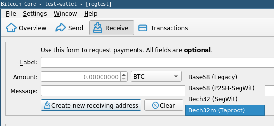

本周的周报介绍了一个尝试逐渐替换成完全支持 “手续费替换（replace-by-fee）” 的另类方案，并宣布了一系列的会议来审核被提议的 ` OP_CHECKTEMPLATEVERIFY ` 软分叉。此外就是我们的常规栏目：软件的新版本和候选版本，以及流行的比特币基础设施项目的重大变更总结。 

## 新闻

- <a id="brief-full-rbf-then-opt-in-rbf" href="#brief-full-rbf-then-opt-in-rbf)">●</a> **短暂支持完全的 RBF，然后实施可选的 RBF**：Jeremy Rubin [回复了][replied]我们在[154 期周报][Newsletter #154]里提过的 Bitcoin-Dev 邮件组中的一个帖子，有关在 Bitcoin Core 里面全面支持 “[手续费替换][replace by fee]”的。当前，任何根据 [BIP125][BIP125] 表态使用 RBF 的交易都可以被手续费更高的另一笔相似交易替换（也有一些限制）。前述的提议是最终让所有交易都变成可以替换的（所以叫 “完全 RBF（full RBF）”） —— 不仅是那些表态了希望拥有可替换性的交易。一些商家曾经暗示，他么希望中继节点让可替换性在合理范围内尽可能难以运用，或至少有选择地难以使用，这样他们就能立即接受尚未确认的交易、发出低价值的商品和服务。

  Rubin 提出的另一种方案依然鼓励迁移到完全 RBF，但建议仅在一个节点首次收到一笔交易的 n 秒内将该交易默认为使用 RBF，在 n 秒之后，则根据其 BIP125 标签来处理。这样的话，商家就能像现在一样，在 n 秒过后接受未确认的交易。更重要的是，这使得依赖于可替换性来保证安全性的协议不再需要担心未选择使用 RBF 的交易，只要合理假设一个协议节点或者瞭望塔能在首次收到该交易的 n 秒内响应即可。

- <a id="bip119-ctv-review-workshops" href="#bip119-ctv-review-workshops)">●</a> **BIP119 CTV 审核研讨会**：Jeremy Rubin 在 Bitcoin-Dev 邮件组中[宣布][announced]他会主持巡回的会议来讨论 [BIP119][BIP119]（[OP_CHECKTEMPLATEVERIFY][OP_CHECKTEMPLATEVERIFY] 的规范），包括这个 BIP 如何部署到网络中。第一次会议会在 UTC 时间 1 月 11 日周二的 20:00 举行，在 Libera.Chat 的 [##ctv-bip-review][##ctv-bip-review] 频道。后续的会议将每隔两周在同一时间举行、一直持续下去。

## 新版本和候选版本

*流行的比特币基础设施项目的新版本和候选版本。请考虑升级到新版本或帮助测试候选版本*。

- <a id="rust-lightning-0-0-104" href="#rust-lightning-0-0-104)">●</a> [Rust-Lightning 0.0.104][Rust-Lightning 0.0.104] 是这个 LN 节点库的最新版本，包含了多个 API 升级。

## 重要的代码和文献变更

*本周出现重大变更的有 [Bitcoin Core][Bitcoin Core]、[C-Lightning][C-Lightning]、[Eclair][Eclair]、[LND][LND]、[Rust-Lightning][Rust-Lightning]、[libsecp256k1][libsecp256k1]、[Hardware Wellet Interface（HWI）](HWI)、[Rust Bitcoin][Rust Bitcoin]、[BTCPay Server][BTCPay Server]、[BDK][BDK]、[比特币升级提议（BIP）](BIP) 以及 [Lightning BOLTs][Lightning BOLTs]。

- <a id="bitcoin-core-23789" href="#bitcoin-core-23789)">●</a> [Bitcoin Core #23789][Bitcoin Core #23789] 导致了新创建的找零输出总是匹配一个目标的输出类型，同时，只要有可能，总是倾向于创建 [P2TR][P2TR] 找零输出。这个 PR 解决了与 taproot 早期采用者的找零输出有关一项[隐私担忧][privacy concern]，即在他们向传统地址支付时，找零输出可能很容易被识别出来。

- <a id="bitcoin-core-23711" href="#bitcoin-core-23711)">●</a> [Bitcoin Core #23711][Bitcoin Core #23711] 记录了 Bitcoin Core 在接收和转发未确认的交易时的对策的几个方面。这个文档可能对钱包以及合约协议的作者很有帮助，他们可能需要依赖于节点的接收和转发行为。

- <a id="bitcoin-core-17631" href="#bitcoin-core-17631)">●</a> [Bitcoin Core #17631][Bitcoin Core #17631] 加入了一个新的 REST 端点来提供[致密区块过滤器][compact block filters]，配置了过滤器和 REST 端点的节点可启用。

- <a id="bitcoin-core-22674" href="#bitcoin-core-22674)">●</a> [Bitcoin Core #22674][Bitcoin Core #22674] 加入了验证交易包的逻辑，并针对节点的交易转发策略做了测试。测试场景中，一个交易包由一笔子交易及其所有未确认的父交易构成。后续的 PR 预计会加入对 [CPFP][CPFP] 和 [RBF][RBF] 的支持从而延伸验证逻辑。

  在一个稍晚的后续 RP 中，可能会加入一种方法来让对等节点可以提交交易包给本地节点，而交易包会根据现在可用的逻辑来验证。这将启用[交易包转发功能][package relay]，增强合约协议（比如闪电网络）的可靠性和安全性。这个 PR 也加入了关于交易包验证规则的[文档][documentation]。

- <a id="bitcoin-core-23718" href="#bitcoin-core-23718)">●</a> [Bitcoin Core #23718][Bitcoin Core #23718] 支持保留和显示[部分签名的比特币交易（PSBT）][PSBT]中的任何哈希值和原像。用于[哈希时间锁（HTLC）][HTLCs]和其它合约协议元件的 PSBT 可能包含一个哈希值，其原像为某一个 PSBT *更新者* 或 *签名者* 所知。为了生成所需的最终交易，可能要提供这个原像。这个 PR 让 BitcoinCore 参与合约交易的生成、管理和敲定的能力更进一步。如果 Bitcoin Core 增加了对 [miniscript][miniscript] 的支持，这方面的能力还可进一步提升。

- <a id="bitcoin-core-17034" href="#bitcoin-core-17034)">●</a> [Bitcoin Core #17034][Bitcoin Core #17034] 加入了对 version 2 PSBT（见[周报第 128 期][Newsletter #128]）和额外的 PSBT 字段的支持，包括[周报第 72 期][Newsletter #72]所述的专用于 PSBT 插件的字段。Bitcoin Core 无法理解专用插件，但现在可以在自己处理的 PSBT 保留它们并将它们显示在  ` decodepsbt ` RPC 的结果中。

- <a id="bitcoin-core-23113" href="#bitcoin-core-23113)">●</a> [Bitcoin Core #23113][Bitcoin Core #23113] 更新了 ` createmultisig ` 以及 ` addmultisig ` RPC，以包含一个警告字段，在用户使用一个[未压缩的公钥][uncompressed public key]创建一个隔离见证的多签地址时发出警告。由于隔离见证的初始实现方式，Bitcoin Core 已经默认了不会转发和挖出花费使用未经压缩的公钥创建的隔离见证输入的交易。这也就意味着，任何用户，只要使用一个未经压缩的公钥来创建一个隔离见证地址，都有可能无法花费这个地址接收到的所有资金。因此，这些 RPC 绝不会为未经压缩的公钥创建 [bech32][bech32] 地址 —— 它们会创建传统地址（base58check）。这个新的警告字段应该可以帮助用户理解，为什么他们得到的是一个另一个类型的地址，而不是自己想要的类型。

- <a id="bitcoin-core-gui-459" href="#bitcoin-core-gui-459)">●</a> [Bitcoin Core GUI #459][Bitcoin Core GUI #459] 更新了生成地址的对话框，除了旧的地址类型以外，可以生成 bech32m 地址了。

  

- <a id="eclair-2090" href="#eclair-2090)">●</a> [Eclair #2090][Eclair #2090] 支持通过 ` max-per-peer-per-second ` 配置选项来限制[洋葱消息][onion messages]的速率。

- <a id="eclair-2104" href="#eclair-2104)">●</a> [Eclair #2104][Eclair #2104] 加入了一个日志消息来警告本地的节点运营者：如果他们的链上即刻可花费的余额低于使用 “[CPFP（子为父偿）手续费加速][CPFP fee bumping]” 和 “[锚点输出][anchor outputs]” 来及时关闭通道所需的预估数额，则会传出警告。闪电网络的开发者和运营者在选择预留值时，可能会希望比较 Eclair 预估的值和[他们][those] [在][in] LND 中得到的预估值。

- <a id="eclair-2099" href="#eclair-2099)">●</a> [Eclair #2099][Eclair #2099] 加入了一个 ` onion-messages ` 配置选项，可以设定成永远不转发[洋葱消息][onion messages]（但仍然允许节点发送和接收消息）、转发所有消息（即使需要跟一新的对等节点开启一个新连接）或者只转发已有连接的消息。

- <a id="libsecp256k1-964" href="#libsecp256k1-964)">●</a> [Libsecp256k1 #964][Libsecp256k1 #964] 为 libsecp256k1 库列举了一个发行流程和一个版本方案。

- <a id="rust-bitcoin-681" href="#rust-bitcoin-681)">●</a> [Rust Bitcoin #681][Rust Bitcoin #681] 加入了对 [BIP371][BIP371] 为 [taproot][taproot] 而设的额外 [PSBT][PSBT] 字段的支持。

- <a id="rust-lightning-1177" href="#rust-lightning-1177)">●</a> [Rust-Lightning #1177][Rust-Lightning #1177] 消除了使用 Rust-Lightning 自身来存储更高层的钱包应用所需的支付信息的需要。取而代之的是，关于支付的根本信息将被加密然后编码到[支付秘密值][payment secret]中。在收到一笔支付时，加密过的支付秘密值会被解密，然后其明文信息会被用来推导该笔支付的 [HTLC][HTLC] 所用的[支付哈希值][payment hash]所对应的[原像][payment preimage]。

  这是对[第 168 期周报][Newsletter #168]介绍的一种想法的简化时间。其它闪电网络实现可能会存储关于一个发票的信息（例如，由一个商家的店面管理软件提供的任意序列的标识符），但 Rust-Lightning 回避了这种方法，因为它是一个库，希望能被直接整合到一个更高级的应用中、让这个高层应用能管理其自身的支付请求的细节。

- <a id="hwi-545" href="#hwi-545)">●</a>  [HWI #545][HWI #545]、[#546][#546] 和 [#547][#547] 通过启用 ` tr() ` 描述符启用了对 [taproot][taproot] 的支持、通过支持 [BIP371][BIP371] 来增加 taproot 的 [PSBT][PSBT] 字段，并在底层的硬件签名设备可用的时候为 taproot 脚本使用 [bech32m][bech32m] 地址。注意，根据这些 PR，HWI 尚未完全支持一些签名设备的 taproot 支持固件，所以这些设备还不能启用 taproot。

- <a id="bips-1126" href="#bips-1126)">●</a> [BIPs #1126][BIPs #1126] 增加了 [BIP52][BIP52]（*Optical Proof of Work*），该 BIP 提议使用来硬分叉来改变比特币，声称它将改变挖矿硬件（资本支出）和电力和运营成本（营运支出）的比重。这个想法在 Bitcoin-Dev 邮件列表中[讨论过][previously discussed]，在那里既有支持者，也有批评者。

[replied]:https://lists.linuxfoundation.org/pipermail/bitcoin-dev/2021-December/019696.html

[Newsletter #154]:https://bitcoinops.org/en/newsletters/2021/06/23/#allowing-transaction-replacement-by-default

[replace by fee]:https://bitcoinops.org/en/topics/replace-by-fee/

[BIP125]:https://github.com/bitcoin/bips/blob/master/bip-0125.mediawiki

[announced]:https://lists.linuxfoundation.org/pipermail/bitcoin-dev/2021-December/019719.html

[BIP119]:https://github.com/bitcoin/bips/blob/master/bip-0119.mediawiki

[OP_CHECKTEMPLATEVERIFY]:https://bitcoinops.org/en/topics/op_checktemplateverify/

[##ctv-bip-review]:https://web.libera.chat/?channels=##ctv-bip-review

[Rust-Lightning 0.0.104]:https://github.com/lightningdevkit/rust-lightning/releases/tag/v0.0.104

[Bitcoin Core]:https://github.com/bitcoin/bitcoin

[C-Lightning]:https://github.com/ElementsProject/lightning

[Eclair]:https://github.com/ACINQ/eclair

[LND]:https://github.com/lightningnetwork/lnd/

[Rust-Lightning]:https://github.com/rust-bitcoin/rust-lightning

[libsecp256k1]:https://github.com/bitcoin-core/secp256k1
[HWI]: https://github.com/bitcoin-core/HWI
[Rust Bitcoin]:https://github.com/rust-bitcoin/rust-bitcoin

[BTCPay Server]:https://github.com/btcpayserver/btcpayserver/

[BDK]:https://github.com/bitcoindevkit/bdk
[BIP]:https://github.com/bitcoin/bips/
[Lightning BOLTs]:https://github.com/lightning/bolts

[Bitcoin Core #23789]:https://github.com/bitcoin/bitcoin/issues/23789

[P2TR]:https://bitcoinops.org/en/topics/taproot/

[privacy concern]:https://bitcoinops.org/en/preparing-for-taproot/#output-script-matching

[Bitcoin Core #23711]:https://github.com/bitcoin/bitcoin/issues/23711

[Bitcoin Core #17631]:https://github.com/bitcoin/bitcoin/issues/17631

[compact block filters]:https://bitcoinops.org/en/topics/compact-block-filters/

[Bitcoin Core #22674]:https://github.com/bitcoin/bitcoin/issues/22674

[CPFP]:https://bitcoinops.org/en/topics/cpfp/

[RBF]:https://bitcoinops.org/en/topics/replace-by-fee/

[package relay]:https://bitcoinops.org/en/topics/package-relay/

[documentation]:https://github.com/glozow/bitcoin/blob/046e8ff264be6b888c0f9a9d822e32aa74e19b78/doc/policy/packages.md

[Bitcoin Core #23718]:https://github.com/bitcoin/bitcoin/issues/23718

[PSBT]:https://bitcoinops.org/en/topics/psbt/

[HTLCs]:https://bitcoinops.org/en/topics/htlc/

[miniscript]:https://bitcoinops.org/en/topics/miniscript/

[Bitcoin Core #17034]:https://github.com/bitcoin/bitcoin/issues/17034

[Newsletter #128]:https://bitcoinops.org/en/newsletters/2020/12/16/#new-psbt-version-proposed

[Newsletter #72]:https://bitcoinops.org/en/newsletters/2019/11/13/#bips-849

[Bitcoin Core #23113]:https://github.com/bitcoin/bitcoin/issues/23113

[uncompressed public key]:https://btcinformation.org/en/developer-guide#public-key-formats

[bech32]:https://bitcoinops.org/en/topics/bech32/

[Bitcoin Core GUI #459]:https://github.com/bitcoin-core/gui/issues/459

[Screenshot address picker]:https://bitcoinops.org/img/posts/2022-01-core-gui-address-picker.png

[Eclair #2090]:https://github.com/ACINQ/eclair/issues/2090

[onion messages]:https://bitcoinops.org/en/topics/onion-messages/

[Eclair #2104]:https://github.com/ACINQ/eclair/issues/2104

[CPFP fee bumping]:https://bitcoinops.org/en/topics/cpfp/

[anchor outputs]:https://bitcoinops.org/en/topics/anchor-outputs/

[those]:https://bitcoinops.org/en/newsletters/2021/01/27/#lnd-4908

[in]:https://bitcoinops.org/en/newsletters/2021/05/19/#lnd-5274

[Eclair #2099]:https://github.com/ACINQ/eclair/issues/2099

[onion messages]:https://bitcoinops.org/en/topics/onion-messages/

[Libsecp256k1 #964]:https://github.com/bitcoin-core/secp256k1/issues/964

[Rust Bitcoin #681]:https://github.com/rust-bitcoin/rust-bitcoin/issues/681

[BIP371]:https://github.com/bitcoin/bips/blob/master/bip-0371.mediawiki

[PSBT]:https://bitcoinops.org/en/topics/psbt/

[taproot]:https://bitcoinops.org/en/topics/taproot/

[Rust-Lightning #1177]:https://github.com/rust-bitcoin/rust-lightning/issues/1177

[payment secret]:https://bitcoinops.org/en/topics/payment-secrets/

[payment preimage]:https://github.com/lightning/bolts/blob/master/00-introduction.md#payment-preimage

[payment hash]:https://github.com/lightning/bolts/blob/master/00-introduction.md#Payment-hash

[HTLC]:https://bitcoinops.org/en/topics/htlc/

[Newsletter #168]:https://bitcoinops.org/en/newsletters/2021/09/29/#stateless-ln-invoice-generation

[HWI #545]:https://github.com/bitcoin-core/HWI/issues/545

[#546]:https://github.com/bitcoin-core/HWI/issues/546

[#547]:https://github.com/bitcoin-core/HWI/issues/547

[taproot]:https://bitcoinops.org/en/topics/taproot/

[descriptors]:https://bitcoinops.org/en/topics/output-script-descriptors/

[BIP371]:https://github.com/bitcoin/bips/blob/master/bip-0371.mediawiki

[PSBT]:https://bitcoinops.org/en/topics/psbt/

[bech32m]:https://bitcoinops.org/en/topics/bech32/

[BIPs #1126]:https://github.com/bitcoin/bips/issues/1126

[BIP52]:https://github.com/bitcoin/bips/blob/master/bip-0052.mediawiki

[previously discussed]:https://lists.linuxfoundation.org/pipermail/bitcoin-dev/2021-May/018951.html

