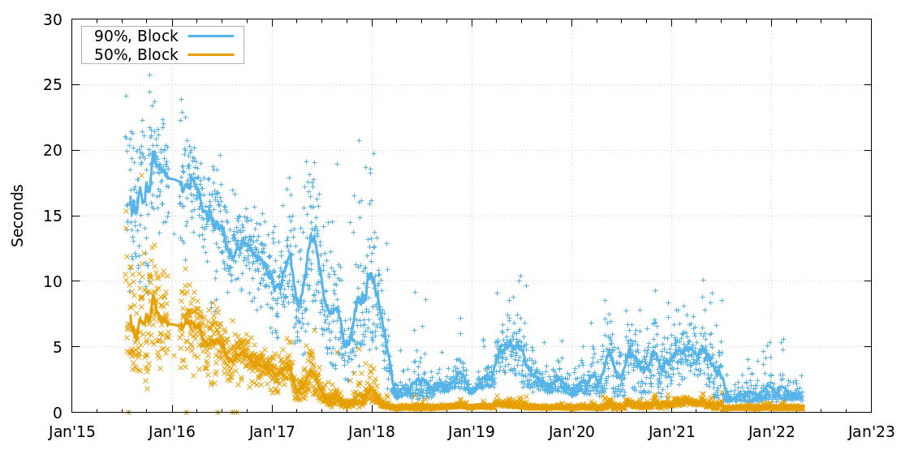

本周的周报总结了关于激活  ` OP_CHECKTEMPLATEVERIFY ` 的讨论，也包含了我们的常规栏目：Bitcoin Stack Exchange 网站上的高票问题和回答、软件的新版本和候选版本，以及热门的比特币基础设施软件最近的变更。

## 新闻

- 关于激活 CTV 的讨论：Jeremy Rubin 在 Bitcoin-Dev 邮件组中[发帖][posted]，列举了他发行新软件、让矿工可以表态是否有意向实施 [BIP119][BIP119] 规则（从而支持 [OP_CHECKTEMPLATEVERIFY][OP_CHECKTEMPLATEVERIFY]（CTV）操作码）的计划。只要接下来某一个 2016 个区块的难度调整周期（约为两个星期）内 90% 的区块都表示积极态度，则使用 Rubin 的软件的节点都会开始执行 CTV 的规则。

  Rubin 详细阐述了相信比特币用户希望立即激活 CTV 的几个原因：

  - *连贯性*：CTV 拥有稳定的规范和实现
  - *热度*：比特币社区中的许多名人和团队都支持 CTV
  - *可行性*：似乎没有任何反对意见声称 CTV 伤害了比特币的任何被高度重视的特性
  - *吸引力*：CTV 提供了用户想要的特性，例如基于[限制条款][covenant]（convenant）的[金库合约][vaults]

  邮件组中有十多位用户回复了 Rubin，有些事直接回复，有些是在别的帖子中恢复了。我们无法总结所有有价值的回复，但我们看到了一些非常有意思的评论：

  - Anthony Towns [分析][analyzed]了 CTV [signet 测试网][signet] 上的交易。看起来几乎所有交易都是用同一种软件（[Sapio][Sapio]）构造出来的，这可能意味着 CTV 缺乏公众的探索。他进一步指出，改变公式规则以添加一个新的特性，会给所有比特币用户带来风险 —— 那些无意使用新特性的用户也不例外 —— 所以，重要的是向不接受这项特性的用户出示公开的证据，证明这项新特性 “对其他人足够有价值，值得你们冒这个风险”。在这个帖子发表后，人们在 CTV signet 上做了[额外的实验][additional experimentation]。

  - Matt Corallo 也[主张][argued]，改变共识会给所有人都带来极大的成本，所以我们应该仅在确保一个提议提供了变更可能获得的最大价值时才尝试软分叉。关于限制条款，Corallo 希望看到 “最灵活、最有用、最好还隐私” 的设计。他[后来说][later said]：“就我所知，CTV 是否真的是一个好选择，还不明晰”。

  - Russell O'Connor 在 \#bitcoin-wizards 在线聊天室中[指出][noted]，一种被提议的使用 CTV 的方法无法与现有的比特币地址格式（比如 base58check、[bech32][bech32] 和 bech32m）交互。通过 *裸脚本*（直接显示在 scriptPubKey 字段中的脚本）使用 CTV 的方法将要求钱包开发者尽在自己的内部交易中使用裸 CTV 或编写特殊的工具来跟通常包含在地址中的信息交互。此外，希望在某些应用（比如[金库合约][vaults]）中使用 CTV 的钱包可以使用承诺后续会使用裸 CTV 的 P2TR 地址来接收支付。

    O'Connor 关于地址局限性的讨论被 Towns 在邮件组中帖子[引用][mentioned]，O'Connor [回复][replied]了更多的细节，还指出，如果对裸 CTV 的支持并非 BIP 119 CTV 规范的一部分，他会支持一种更简单、更可组合（易于与其它操作码结合来产生有用的脚本）的不同设计 —— 虽然，除此之外，他还更喜欢更通用的  ` OP_TXHASH `  设计（见[第 185 期周报][Newsletter #185]）。Rubin [回复了][replied]多方面的对比。

  - David Harding [转发][relayed]了一种担心：CTV 可能不会得到长期的使用，要么因为它的用途并不明显，要么因为其它的限制条款构造可以更好地服务热门的应用。这可能会给未来的共识代码开发者带来潜在的负担：他们还要维护 CTV 的代码以及分析其与未来提议的共识变更的交互可能。Harding 建议暂时给比特币加入为期 5 年的 CTV 功能支持，在这段时间里收集用户如何使用它的数据，然后自动禁用它，除非在 5 年后用户认为这个功能值得保持。没有回应表示喜欢这种方法，大部分人认为这样做的成本太高而收益太小。还要指出的是，未来的任一节点，如果要完全验证在 CTV 激活期间产生的区块，都依然需要 CTV 验证代码，所以 CTV 代码也需要永远维护，即使这个操作码在 5 年后禁用了。

  - Antoine “Darosior” Poinsot [请求][requested]对激活 [BIP118][BIP118] 的轻微改进版本（[APO][APO]）而非 CTV、至少先于 CTV 激活 APO 意见的反馈。这种对 APO 的改进使之能模拟 CTV 的功能，虽然对一些应用来说成本会更高。激活 APO 也使得其最初设想的用户（在闪电网络上启用 [Eltoo][Eltoo] 层）成为可能，使得闪电网络通道可以实现更高效甚至更安全的状态更新机制。

  - James O'Beirne [提出][suggested]他的基于 CTV 的[简单金库合约][simple vault]设计可以作为评估不同的限制条款设计的基准，因为它很简洁；而且，据他估计，如果它被用在生产环境中，它可以极大地强化许多比特币应用的安全性。Darosior 是第一个接受这个挑战的人，他将简单金库合约的代码从基于 CTV 的[移植][porting]成了基于  ` SIGHASH_ANYPREVOUT ` 的。

  截至这份总结撰写之时，邮件组中的讨论依然非常活跃。许多关于 CTV 和限制条款技术的有趣讨论也在推特、IRC、Telegram 等等空间里发生。我们欢迎这些讨论的参与者在 Bitcoin-Dev 邮件组中分享重要的洞见。

  在上面总结的这些讨论发生后，Jeremy Rubin [表示][announced]他不会立即放出允许激活 CTV 的软件的二进制包。他会先评估收到的反馈，并跟其他 CTV 支持者一起合作，可能会提出一个稍微不同的激活计划。Optech 会在未来的周报中播报后续进展。

## Bitcoin Stack Exchange 网站的精选问答

*[Bitcoin Stack Exchange][Bitcoin Stack Exchange] 是 Optech 贡献者查找问题答案的首选之地 —— 也是他们有闲暇时会帮助好奇和困惑的用户的地方。在这个每月一次的栏目中，我们会挑出自上次栏目更新以来新出现的高赞问题和回答。*

- [secp256k1 曲线中的生成点 G 是怎么挑选出来的？][How was the generator point G chosen in the secp256k1 curve?] Pieter Wuille 指出，选择恒定的[生成点 G][generator point G]背后的确切理由我们并不知晓，但一个罕见的属性可能暗示了它的构造过程。

- [现实中一条 P2P 消息的最大负载体积是多大？][What is the maximum, realistic P2P message payload size?] 0xb10c 询问是否存在一条有效的 [P2P 消息][P2P message]能达到  ` MAX_SIZE ` （32 MB）。Pieter Wuille 解释道，参数 ` MAX_PROTOCOL_MESSAGE_LENGTH `（现在是 [4MB][4MB]，原来是 [2MB][2MB]，是作为 [segwit 的一部分][part of segwit]而变更的）是实际上限制传入消息的体积的参数，这可以防止拒绝服务式攻击。

- [是否有证据表明已不存在 “陈旧区块（stale blocks）”？][Is there evidence for lack of stale blocks?] Lightlike 引用了一个来自 [KIT statistics][KIT statistics] 的关于区块传播时间的历史图表，并指出最初由 [#8068][#8068] 实现的 [“致密区块中继”][compact block relay]（[BIP152][BIP152]）使得[陈旧区块][stale block]出现的频率逐步降低。

  

- [coinbase 交易的输入字段中有 VOUT 字段吗？][Does a coinbase transaction’s input field have a VOUT field?] Pieter Wuille 列举了一笔 coinbase 交易的输入的要求：前序输出哈希值必须是  ` 0000000000000000000000000000000000000000000000000000000000000000 ` ，前序输出索引号必须是  ` ffffffff ` ，它必须有一个 2-100 字节长的  ` scriptSig ` ，而因为 [BIP34][BIP34] 的关系， ` scriptSig `  也必须以区块高度开头。

## 新版本和候选版本

*流行比特币基础设施项目的新版本和候选版本。请考虑升级到最新版本或帮助测试候选版本。*

- [Bitcoin Core 23.0][Bitcoin Core 23.0] 是这个主流全节点软件的下一个大版本。[更新说明][release notes]例举了多项提升，包括默认为新钱包使用[描述符][descriptor]钱包，而且现在描述符钱包现在容易支持使用 [taproot][taproot] 的 [bech32m][bech32m] 
- [Core Lightning 0.11.0][Core Lightning 0.11.0] 是这个热门闪电网络节点软件的下一个大版本。除了一些新特性和 bug 修复，新版本还支持与同一个对等节点开设多个通道，并给[无状态发票][stateless invoices]支付。
- [Rust-Bitcoin 0.28][Rust-Bitcoin 0.28] 是这个 Bitcoin 库的最新版本。最重大的更新是增加对 taproot 的支持并升级了相关的 API，比如跟 “部分签名的比特币交易”（[PSBT][PSBTs]）有关的。 其他升级和 bug 修复在这份[更新声明][release notes]中有述。

## 重大代码及文档变更

本周内出现重大变更的项目有：[Bitcoin Core][Bitcoin Core]、[Core Lightning][Core Lightning]、[Eclair][Eclair]、[LDK][LDK]、[LND][LND]、[libsecp256k1][libsecp256k1]、[Hardware Wallet Interface (HWI)][Hardware Wallet Interface (HWI)]、[Rust Bitcoin][Rust Bitcoin]、[BTCPay Server][BTCPay Server]、[BDK][BDK]、[Bitcoin Improvement Proposals (BIPs)][Bitcoin Improvement Proposals (BIPs)] 和 [Lightning BOLTs][Lightning BOLTs]。

- [LND #5157][LND #5157] 加入了一个  ` --addpeer ` 启动选项，它会跟所提供的节点开启一个对等连接。
- [LND #6414][LND #6414] 将在节点对 keysend [自发支付][spontaneous payments]的支持启用之后广而告之。LND 从 2019 年就支持 keysend 功能，但最开始部署的时候，节点并没有办法告知他人自己支持这个功能。其他闪电网络节点软件中的 keysend 实现宣布支持节点广告之后，这次合并到 LND 中的 PR 复制了这个功能。

[posted]:https://lists.linuxfoundation.org/pipermail/bitcoin-dev/2022-April/020233.html

[BIP119]:https://github.com/bitcoin/bips/blob/master/bip-0119.mediawiki

[OP_CHECKTEMPLATEVERIFY]:https://bitcoinops.org/en/topics/op_checktemplateverify/

[covenant]:https://bitcoinops.org/en/topics/covenants/

[vaults]:https://bitcoinops.org/en/topics/vaults/

[analyzed]:https://lists.linuxfoundation.org/pipermail/bitcoin-dev/2022-April/020234.html

[signet]:https://bitcoinops.org/en/topics/signet/

[Sapio]:https://learn.sapio-lang.org/

[additional experimentation]:https://twitter.com/fiatjaf/status/1517836181240782850
[argued]:https://lists.linuxfoundation.org/pipermail/bitcoin-dev/2022-April/020263.html

[later said]:https://lists.linuxfoundation.org/pipermail/bitcoin-dev/2022-April/020289.html

[noted]:https://gnusha.org/bitcoin-wizards/2022-04-19.log

[bech32]:https://bitcoinops.org/en/topics/bech32/

[vaults]:https://bitcoinops.org/en/topics/vaults/

[mentioned]:https://lists.linuxfoundation.org/pipermail/bitcoin-dev/2022-April/020245.html

[replied]:https://lists.linuxfoundation.org/pipermail/bitcoin-dev/2022-April/020256.html

[Newsletter #185]:https://bitcoinops.org/en/newsletters/2022/02/02/#composable-alternatives-to-ctv-and-apo

[replied]:https://lists.linuxfoundation.org/pipermail/bitcoin-dev/2022-April/020260.html

[relayed]:https://lists.linuxfoundation.org/pipermail/bitcoin-dev/2022-April/020242.html

[requested]:https://lists.linuxfoundation.org/pipermail/bitcoin-dev/2022-April/020276.html

[BIP118]:https://github.com/bitcoin/bips/blob/master/bip-0118.mediawiki

[APO]:https://bitcoinops.org/en/topics/sighash_anyprevout/

[Eltoo]:https://bitcoinops.org/en/topics/eltoo/

[suggested]:https://lists.linuxfoundation.org/pipermail/bitcoin-dev/2022-April/020280.html

[simple vault]:https://github.com/jamesob/simple-ctv-vault

[porting]:https://twitter.com/darosior/status/1518961471702642689

[announced]:https://twitter.com/JeremyRubin/status/1518477022439247872

[Bitcoin Stack Exchange]:https://bitcoin.stackexchange.com/

[How was the generator point G chosen in the secp256k1 curve?]:https://bitcoin.stackexchange.com/a/113116

[generator point G]:https://bitcoin.stackexchange.com/questions/29904/

[What is the maximum, realistic P2P message payload size?]:https://bitcoin.stackexchange.com/a/113059

[P2P message]:https://developer.bitcoin.org/reference/p2p_networking.html#data-messages

[4MB]:https://github.com/bitcoin/bitcoin/commit/2b1f6f9ccf36f1e0a2c9d99154e1642f796d7c2b

[2MB]:https://github.com/bitcoin/bitcoin/issues/5843

[part of segwit]:https://github.com/bitcoin/bitcoin/issues/8149

[Is there evidence for lack of stale blocks?]:https://bitcoin.stackexchange.com/a/113413

[KIT statistics]:https://www.dsn.kastel.kit.edu/bitcoin/index.html

[compact block relay]:https://bitcoinops.org/en/topics/compact-block-relay/

[BIP152]:https://github.com/bitcoin/bips/blob/master/bip-0152.mediawiki

[#8068]:https://github.com/bitcoin/bitcoin/issues/8068

[stale block]:https://bitcoin.stackexchange.com/a/5866/87121

[Does a coinbase transaction’s input field have a VOUT field?]:https://bitcoin.stackexchange.com/a/113392

[BIP34]:https://github.com/bitcoin/bips/blob/master/bip-0034.mediawiki

[Bitcoin Core 23.0]:https://bitcoincore.org/bin/bitcoin-core-23.0/

[release notes]:https://github.com/bitcoin/bitcoin/blob/master/doc/release-notes/release-notes-23.0.md

[descriptor]:https://bitcoinops.org/en/topics/output-script-descriptors/

[bech32m]:https://bitcoinops.org/en/topics/bech32/

[taproot]:https://bitcoinops.org/en/topics/taproot/

[Core Lightning 0.11.0]:https://github.com/ElementsProject/lightning/releases/tag/v0.11.0.1

[stateless invoices]:https://bitcoinops.org/en/topics/stateless-invoices/

[Rust-Bitcoin 0.28]:https://github.com/rust-bitcoin/rust-bitcoin/releases/tag/0.28.0

[PSBTs]:https://bitcoinops.org/en/topics/psbt/

[release notes]:https://github.com/rust-bitcoin/rust-bitcoin/blob/master/CHANGELOG.md#028---2022-04-20-the-taproot-release

[Bitcoin Core]:https://github.com/bitcoin/bitcoin

[Core Lightning]:https://github.com/ElementsProject/lightning

[Eclair]:https://github.com/ACINQ/eclair

[LDK]:https://github.com/lightningdevkit/rust-lightning

[LND]:https://github.com/lightningnetwork/lnd/

[libsecp256k1]:https://github.com/bitcoin-core/secp256k1

[Hardware Wallet Interface (HWI)]:https://github.com/bitcoin-core/HWI

[Rust Bitcoin]:https://github.com/rust-bitcoin/rust-bitcoin

[BTCPay Server]:https://github.com/btcpayserver/btcpayserver/

[BDK]:https://github.com/bitcoindevkit/bdk

[Bitcoin Improvement Proposals (BIPs)]:https://github.com/bitcoin/bips/

[Lightning BOLTs]:https://github.com/lightning/bolts

[LND #5157]:https://github.com/lightningnetwork/lnd/issues/5157

[LND #6414]:https://github.com/lightningnetwork/lnd/issues/6414

[spontaneous payments]:https://bitcoinops.org/en/topics/spontaneous-payments/

